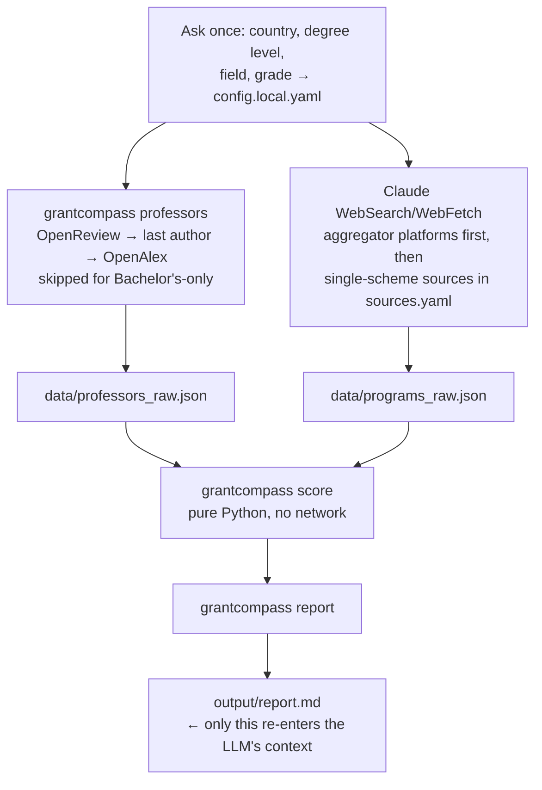

<p align="center">
  <picture>
    <source media="(prefers-color-scheme: dark)" srcset="assets/banner-dark.svg">
    <source media="(prefers-color-scheme: light)" srcset="assets/banner-light.svg">
    
  </picture>
</p>

<p align="center">
  <a href="LICENSE"></a>
  
  
  
  
</p>

<p align="center">
  <b>GrantCompass finds fully-funded scholarships for whatever degree you're after (Bachelor's, Master's, PhD) and whatever country you name, defaulting to Europe if you don't have one in mind.</b><br>
  It also points you to the professors doing relevant research, and it does the whole thing without dumping a pile of scraped web pages into an LLM's context.
</p>

---

### Contents

- [Why I built this](#why-i-built-this)
- [What it actually does](#what-it-actually-does)
- [Example output](#example-output)
- [How it works](#how-it-works)
- [Quick start](#quick-start)
- [Architecture](#architecture)
- [Design notes](#design-notes)
- [Roadmap](#roadmap--future-scope)
- [Credits & prior art](#credits--prior-art)
- [Author](#author)

## Why I built this

I went looking for something that could find fully-funded study options matched to my grades and field, and came up mostly empty. There are a handful of "PhD finder" repos on GitHub, but they all had a problem for me: one only covers professors in the US, UK, Canada and Australia, one needs its own paid LLM key plus a Feishu account just to rank a list, and none of them know what a funding scheme is or care what level you're applying at. Bachelor's students especially seem to get ignored by every one of these tools, even though there's just as much scholarship money out there for undergrad as there is for a PhD.

So I read through all three, kept the parts worth keeping, threw out the two repos' code entirely since neither one has a license (more on that below), and built this instead. It's not tied to any one degree level or, really, any one continent. Europe is just the default because that's what I needed first, and it's where the source list is deepest right now.

## What it actually does

Point it at a field and a set of grades, and it goes and finds three things: scholarships and funded programs at whichever degree level you're targeting, professors doing relevant research if you're applying to a Master's or PhD, and a score for each result based on how well your grades and interests actually line up with it.

The scoring part matters more than it sounds like it should. Most of these lists are just... lists. GrantCompass tells you whether your grade is a comfortable fit, a borderline case, or genuinely below what a scheme typically expects, and it never just silently drops something because it thinks you won't qualify. You make that call, not the tool.

It checks the big aggregator sites first (Scholarshipportal, Bachelorsportal, Mastersportal, PhDportal, European Funding Guide) since each of those already lists thousands of individual scholarships in one place, then works through the named schemes (DAAD, Erasmus and Erasmus Mundus, MSCA, EURAXESS, Stipendium Hungaricum, Türkiye Bursları) and a few national job boards to fill in anything the aggregators missed.

## Example output

This is what lands in `output/report.md` after a run. (The rows below are for illustration, not a hardcoded answer, real ones come from a live search.)

| name | type | source | country_code | gpa_fit | match_score | deadline | url |
|---|---|---|---|---|---|---|---|
| EMARO+ Erasmus Mundus Robotics | MS | Erasmus Mundus Joint Masters Catalogue | EU | meets_minimum | 1.0 | 2027-01-15 | eacea.ec.europa.eu/... |
| Dr. A. Visser, Robotics & Embedded AI | PI | OpenReview/OpenAlex PI match | NL | meets_minimum | 0.75 | — | openalex.org/... |
| DAAD EPOS Postgraduate Scholarship | PhD | DAAD Scholarship Database | DE | borderline | 0.6 | 2026-10-31 | daad.de/... |

That's the whole answer. No "Great question!", no re-explaining what a scholarship is, no filler before or after the table.

## How it works



Here's the actual reason this is cheap to run: fetching, parsing, deduping and scoring never touch an LLM at all. They're just Python, sitting behind a CLI (`professors.py`, `score.py`, `report.py`). The only two things that genuinely need a live agent are asking you a few questions up front and pulling current listings from sites that don't have a stable API. For both of those, Claude Code uses the WebSearch/WebFetch tools it already has, so there's no second API key to pay for. And once it's fetched what it needs, it only reads one short table back into its own context, not the pages it scraped to get there.

## Quick start

```bash
git clone https://github.com/rx290/grant-compass.git
cd grant-compass
pip install -e .

grantcompass init            # copies config.example.yaml -> config.local.yaml (gitignored)
$EDITOR config.local.yaml    # country/countries (default: Europe), degree level(s), field, grade + scale

grantcompass professors      # deterministic OpenReview + OpenAlex pass, no LLM (MS/PhD only)
# program/funding listings need live web access, see "Inside Claude Code" below,
# or fetch them yourself against src/grantcompass/sources.yaml into data/programs_raw.json

grantcompass score
grantcompass report
cat output/report.md
```

### Inside Claude Code

```bash
bash setup.sh     # symlinks .claude/skills/grant-compass into ~/.claude/skills/
```

Then just ask something like *"find funded robotics scholarships in Germany"* or *"find a funded bachelor's in computer engineering, I'm open to anywhere in Europe."* If you haven't set up a profile yet, Claude will ask you directly instead of guessing, country, degree level, field, grade, then write it to `config.local.yaml`, run the deterministic steps, and only do the live web search itself. The full logic is in [`SKILL.md`](.claude/skills/grant-compass/SKILL.md) if you want to see exactly what it's told to do.

## Architecture

```
src/grantcompass/
  config.py       # loads config.local.yaml (gitignored) or falls back to config.example.yaml
  sources.yaml    # curated registry, tagged by degree level + region: aggregator platforms
                  # (Scholarshipportal/Bachelorsportal/Mastersportal/PhDportal/European Funding
                  # Guide) first, then DAAD, Erasmus/Erasmus Mundus, MSCA, EURAXESS, national
                  # schemes, national job boards
  professors.py   # OpenReview -> last author -> OpenAlex enrichment -> filtered to Europe
  score.py        # grade-eligibility + keyword-match scoring, pure functions, unit tested, no I/O beyond JSON
  report.py       # scored.json -> output/report.md (compact) + output/full_results.csv (complete)
  cli.py          # `grantcompass init|professors|score|report`
.claude/skills/grant-compass/SKILL.md   # the Claude Code skill definition, token-budget rules and onboarding questions live here
tests/test_score.py                     # grade-fit + keyword-match logic, no network
```

`config.local.yaml`, `data/`, and `output/` are gitignored. Your name, grade, and search results never get committed to this repo.

## Design notes

**Why check the aggregator platforms first?** Scholarshipportal, Bachelorsportal, Mastersportal, PhDportal (all part of the StudyPortals network) and European Funding Guide already pull together thousands of scholarships from different providers into one searchable site. One query there covers a lot of ground. The single-scheme sources get checked afterward mainly to catch anything the aggregators missed, and that ordering keeps the number of web requests down too.

**Why not just scrape DAAD, FindAPhD, or the Erasmus Mundus catalogue directly?** None of them expose a real public API, scraping them risks breaking their terms of service, and any scraper breaks the moment they redesign the page, which is basically what happened to the projects I looked at before building this. `professors.py` is the only script here that makes its own HTTP calls, and it only talks to OpenReview and OpenAlex, both free, public APIs meant to be used this way. Everything else gets fetched live, one page at a time, by Claude's own WebSearch/WebFetch, which is closer to how a person would actually go look this stuff up anyway.

**Grade fit is a signal, not a gate.** `score.py` marks every result `meets_minimum`, `borderline`, or `below_typical_minimum` against what a scheme type typically asks for, and sorts on that, but it never removes a result just because your grade looks low. It also converts whatever scale you use (GPA, CGPA, a percentage) onto a common 4.0-equivalent, so it treats a Bachelor's applicant's school-leaving percentage the same way it treats a Master's applicant's 4.0 CGPA. Still, always check the actual number on the program's own page. These are rough signals, not guarantees, and published minimums change.

## Roadmap / future scope

- [ ] RSS-based ingestion where it's available (EURAXESS supports `&format=rss` on saved searches) to cut down on live WebFetch calls
- [ ] A `grantcompass watch` mode for periodic re-runs (through `/loop` in Claude Code, say) that diffs against the last run and only surfaces what's new
- [ ] Deadline-aware sorting once more sources actually expose structured deadline data
- [ ] Per-region sub-registries (Nordic, DACH, Benelux) as the source list grows past what one file can hold cleanly
- [ ] A `grantcompass export --ics` command to drop deadlines straight into a calendar
- [ ] Extending past Europe: Fulbright, Chevening, Commonwealth, Gates Cambridge, MEXT, Australia Awards, all of it slots into the same `region` tag that's already in `sources.yaml`, so this is new entries and a filter, not a rewrite
- [ ] Community-contributed `sources.yaml` entries for fields outside CS/engineering
- [ ] Basic CI once there's more than one contributor to it

If you add a source or fix something, open a PR, I'll take a look.

## Credits & prior art

I built this after reading through three existing tools and taking different pieces from each. No code came from the two repos with no license attached, only the ideas did, rebuilt from scratch on different, ToS-safe data sources:

- **[arjunk00/phd-finder](https://github.com/arjunk00/phd-finder)**, no license (all rights reserved by default). What I took: the idea of mining accepted conference papers on OpenReview to find active PIs, then enriching them with citation metrics. No code from this one.
- **[dreamhungry/ScholarScout-Agent](https://github.com/dreamhungry/ScholarScout-Agent)**, MIT licensed. What I took: the general shape of a config-driven source registry feeding a two-stage filter-then-rank pipeline. MIT means code reuse is fine here, so I adapted that shape, but rebuilt it independently, without the React frontend, the Feishu integration, or the dependency on a separately-billed LLM API.
- **[mahadi-hasan-cse/phd-finder](https://github.com/mahadi-hasan-cse/phd-finder)**, no license (all rights reserved by default). What I took: a config-driven applicant profile feeding a staged pipeline with composite scoring. No code from this one either. That project is scoped to the US, UK, Canada and Australia and to PhD professors specifically; this one covers Europe by default (extensible past it), any degree level, and adds explicit grade-fit scoring on top.

## Author

**Muhammad Asad Waseem**, [github.com/rx290](https://github.com/rx290) · [LinkedIn](https://linkedin.com/in/muhammadasadwaseem)

I built this while looking for my own funded study options and getting frustrated that nothing out there actually covered what I needed. If it saves you the same trouble, a star helps other people find it.

## License

MIT, see [LICENSE](LICENSE).
